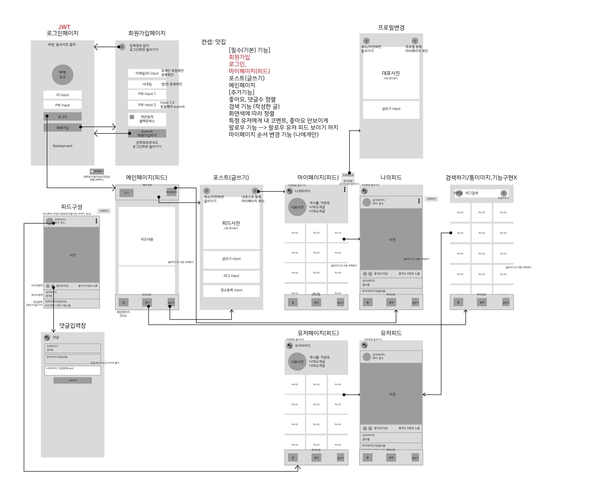

# 9k밥 (9kbab) 🍲

## 1. 설명
9천원 이하의 가성비 맛집 정보를 공유하는 SNS

## 2. 와이어프레임

## 3. API 설계

| 기능 | 세부 | Method | URL | request | response |
| --- | --- | --- | --- | --- | --- |
| 회원가입 | 아이디, 패스워드 ,닉네임 등록 | POST | /signup | {’id’:id, ’email’:email, ‘password’:password, ‘nickname’:nickname} | DB 저장 YES or NO |
| 로그인 |  | POST | /login | {’email’:email, ‘password’:password | DB  select YES or NO |
| 메인페이지 |  | GET | /mainfeed |  | 전체 피드 리스트 |
| 프로필 편집 |  | PUT(POST) | /profile(/edit) | {’photo’:photo, ‘nickname’:nickname,’introduce’:introduce} | DB 수정 YES or NO |
| 글 작성 |  | POST | /post | {’photo’:photo, ‘writing’: writing, ‘location’:location’, ‘tag’:tag} | DB 저장 YES or NO  |
| 글 편집 |  | PUT(POST) | /post(/edit) | {’photo’:photo, ‘writing’:writing, ‘location’:location’, ‘tag’:tag} | DB 수정 YES or NO  |
| 글 삭제 |  | DELETE(POST) | /post(/delete) | {’postid’:postId} | DB 삭제 YES or NO  |
| 내 피드 불러오기 |  | POST | /myfeed | {’id’:id} | 전체 나의 피드 리스트 |
| 내 피드 삭제하기 |  | DELETE(POST) | /myfeed(/delete) | {’postId’:postId} | DB 삭제 YES or NO  |
| 마이페이지 |  | POST | /mypage | {’nickname’:nickname} | 프로필 정보, 나의 피드 리스트 |
| 댓글 페이지 |  | GET | /post/:id/comment | id={게시글 넘버} | 해당 게시글 댓글 리스트 |
| 좋아요 | 게시글 좋아요 카운트 | GET | /post/:id/like | id={게시글 넘버} | 해당 게시글 좋아요 카운트 |
| 좋아요 | like 생성 | PUT(POST) | /post/:id/like | {’postId’:postId, ‘id’:id} | DB update YES or NO  |
| 댓글 |  | POST | /post/:id/comment | {’comment’:comment, ‘postId’: postId, ‘id’:id} | DB 저장 YES or NO |
