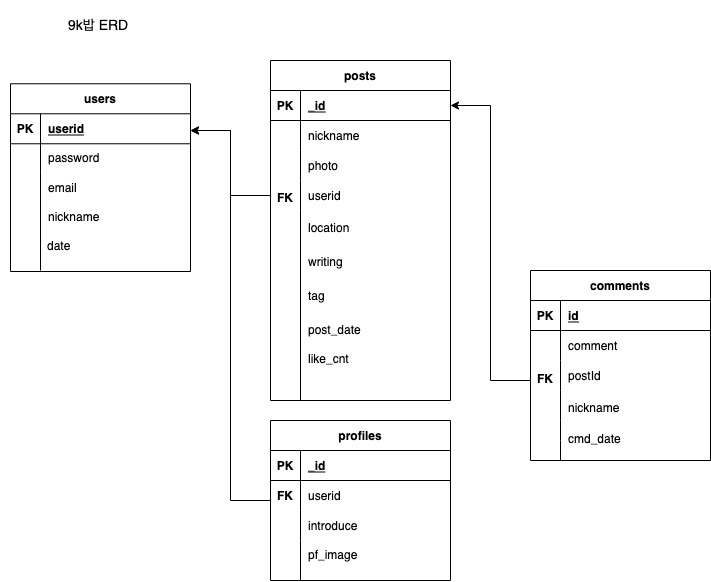

# 9k밥 (9kbab) 🍲

## 설명
9천원 이하의 가성비 맛집 정보를 공유하는 SNS (모바일 최적화)   
http://beloved-coder.shop/

시연영상: https://youtu.be/sanaSKuFWZI
___
# Version 2.0
## 기간
2022-01-12 ~ 2022-01-18 (7일)

## 팀 구성
* 정유진: 프론트엔드, 디자인 [</a>](https://github.com/Augustj88)
* 박다희: 백엔드, API설계 [</a>](https://github.com/https://github.com/DaheePark-00)
* 고희석: 데이터 분석, AI 모델 개발 [</a>](https://github.com/GoHeeSeok00)
* 최중재: 팀장 [</a>](https://github.com/joong8812)

## 기능
* [포스트(글쓰기)] 자동 태그 추천
* [회원가입] 숫자인식으로 올바른 사용자인지 판단
* [댓글페이지] 댓글 작성 및 리스트 확인
* [메인페이지] 좋아요
* [마이페이지] 스크랩 된 포스트 확인

## 기술
</a>
</a>
</a>
</a>
</a>
</a>
</a>
</a>
</a>
</a>
___
# Version 1.0
## 기간
2021-12-28 ~ 2022-01-04 (8일)
## 팀 구성
* 박다희: 프론트엔드, 디자인 [</a>](https://github.com/DaheePark-00)
* 정유진: 프론트엔드, 디자인 [</a>](https://github.com/Augustj88)
* 고희석: 백엔드, API설계 [</a>](https://github.com/GoHeeSeok00)
* 정기홍: 백엔드, 테스트 [</a>](https://github.com/ghj99)
* 최중재: 팀장, EC2 [</a>](https://github.com/joong8812)

## 기술
</a>
</a>
</a>
</a>
</a>
</a>
</a>
</a>

## 와이어프레임

## DB 구성 

## API 설계
https://docs.google.com/spreadsheets/d/1Go6Q0_a_tThV-mW5M_AYbllUghzKKsB13raXD7XKKk4/edit#gid=0

